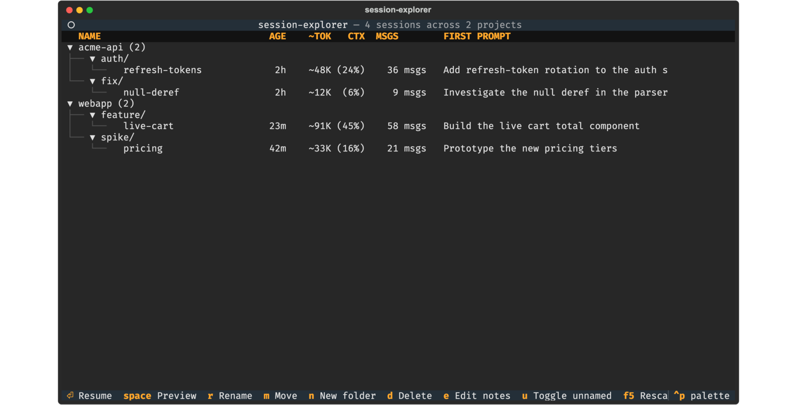
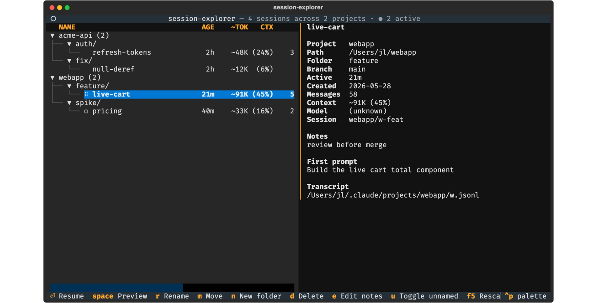
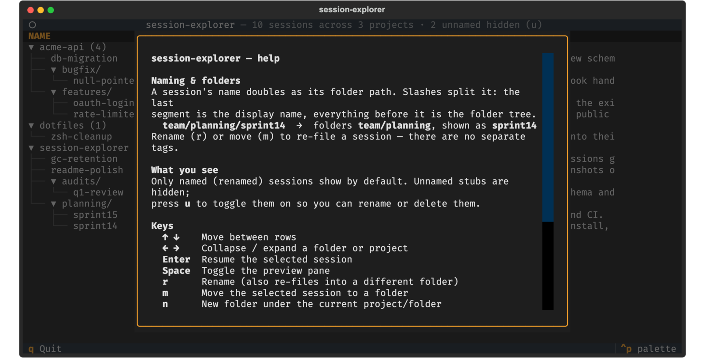
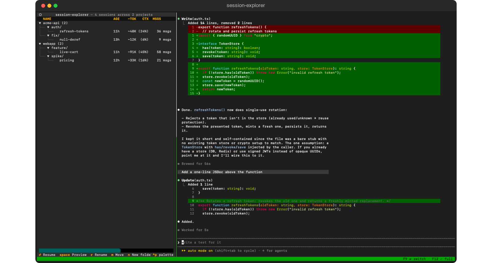
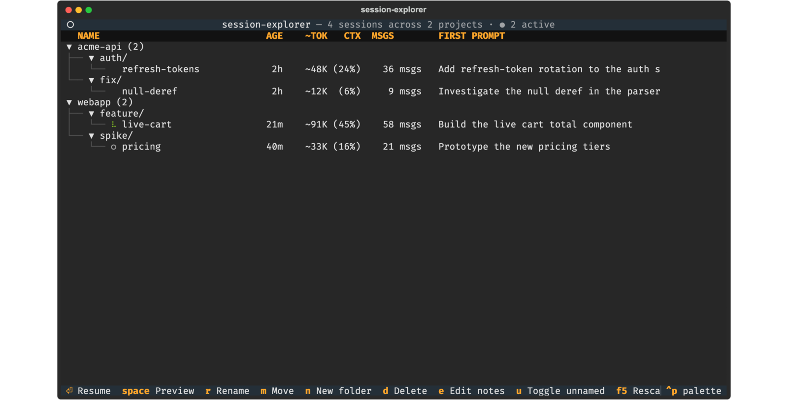

# session-explorer

[](https://github.com/johan-lindahl/session-explorer/actions/workflows/ci.yml)

A Claude Code plugin that turns `~/.claude/projects/*.jsonl` transcripts into a
file-explorer-style listing: browse, organize, and resume sessions from a single
slash command.

The Textual TUI gives you arrow navigation, expand/collapse, rename, move,
delete, notes, a preview pane, live filter, and a live indicator showing which
sessions are running right now. The text-mode `list` subcommand remains for
scripting.

See [`SPEC.md`](./SPEC.md) for the full design.

## What it looks like

Sessions are grouped by project, then by the `/`-separated folders encoded in
their names. Stat columns show age, approximate context size, the share of the
context window used, and message count.



Press `Space` for a preview pane with the full name, project, branch, notes,
first prompt, and transcript path:



Press `h` for the built-in help (it also auto-opens on first launch):



### Side by side with your session

When tmux is available, resuming doesn't take over the terminal. The explorer
stays in the **left** pane and the session you resume docks in a pane on the
**right**, so you watch the tree and the running session at once. `F9` flips
focus between the two panes (or click either one), `F12` zooms the focused pane
fullscreen, and the tmux status line keeps those hints visible even when a pane
is zoomed. Selecting a different session swaps it in; the others keep running
off-screen. Press `c` to start a brand-new session, which docks the same way.



Without tmux, resume instead hands the whole terminal straight to `claude`.

### Live sessions

Sessions running right now are flagged in the left column — an animated green
spinner for a session actively working, a dim `○` for one that's open but idle —
and the subtitle shows `● N active`. Live rows refresh from their transcript
about every 2 seconds, so the first prompt, message count, tokens, and context %
fill in and tick up as the agent works. Live sessions appear even when unnamed.



> Screenshots use sample data.

## Install

This GitHub repo **is** the plugin marketplace — there's no separate packaging
or publishing step. Installing and distributing are the same two commands.

### Option A — Claude Code marketplace (recommended; also how you share it)

Run these inside Claude Code:

```
/plugin marketplace add johan-lindahl/session-explorer
/plugin install session-explorer@session-explorer
```

`session-explorer@session-explorer` is `<plugin-name>@<marketplace-name>`; both
happen to be `session-explorer` here.

**Distributing to colleagues:** the repo is public, so just send them those two
lines — no access grants needed. When you push a new version, they update with:

```
/plugin marketplace update session-explorer
/plugin install session-explorer@session-explorer
```

### Option B — plain shell installer (local development)

```bash
git clone https://github.com/johan-lindahl/session-explorer.git
cd session-explorer
./install.sh
```

Both paths register session-explorer's lifecycle hooks (session indexing plus
the live-session indicator). Neither touches your Claude Code settings: managing
session retention (which changes `cleanupPeriodDays`) is **opt-in** — the
explorer asks the first time you open it. See
[Cleanup & retention](#cleanup--retention).

> **Platform note:** `/session-explorer:open` opens the TUI in a new terminal
> window — **macOS** (Terminal.app) and **Linux** (your `$TERMINAL` or a known
> emulator) are supported directly. On **Windows, use WSL**: the plugin runs as
> a Linux app there, and the launcher opens a Windows Terminal window back into
> your distro when `wt.exe` is available. If no launcher is found on any
> platform, the command to run is printed so you can paste it into a terminal
> yourself. Native (non-WSL) Windows is not supported.

### Add to your Dock (macOS)

Once installed (either path above), create a clickable Dock launcher:

```
session-explorer install-app
```

This builds `~/Applications/Session Explorer.app` with the explorer icon and
pins it to your Dock. Clicking it opens the explorer in a new Terminal window —
**with tmux**, the same as `/session-explorer:open`. If automatic pinning
doesn't take, drag the app from `~/Applications` onto your Dock yourself.

To remove it later, run the uninstall (it removes the app and unpins it):

```
session-explorer uninstall
```

## Usage

After install, start any new Claude Code session in any project. The hook
records the session into `~/.claude/session-explorer-index.json` automatically.

From inside Claude:

```
/session-explorer:open
```

(Plugin commands are always namespaced as `<plugin-name>:<command>` — there's
no way to drop the prefix.)

This opens a new Terminal.app window showing your sessions grouped by project
and folder. Quit the TUI with `q` to close the window.

From a regular shell:

```bash
session-explorer list      # text listing
session-explorer launch    # open in a new Terminal window
session-explorer tui       # run the TUI in the current terminal
```

## TUI keybindings

| Key | Action |
|---|---|
| `↑` `↓` | Move between rows |
| `←` `→` | Collapse / expand the current folder or project |
| `Enter` | Resume the selected session — when tmux-hosted, docks it in a pane beside the tree and focuses it so you can type; without tmux, hands the terminal to `claude --resume <id>` |
| `c` | Create a new session in the selected project (prompts for a name, working directory, and optional git worktree; docks it like a resume). **Leave the name blank** to start a throwaway *unnamed* session — it's hidden by default and auto-reaped by `--gc`. The tree cursor jumps to the new session once it appears. |
| `Space` | Toggle the preview pane (full name, project, folder, branch, age, created, messages, context, session id, notes, first prompt, path) |
| `r` / `F2` | Rename a session (also moves it between folders), or rename a folder's last segment in place — folder renames cascade across the whole subtree |
| `n` | Create an empty folder |
| `m` | Move a session to a folder, or re-parent a whole folder under another path (`(ungroup)` for top level) |
| `d` | Delete the selected session (confirms; removes the JSONL too), or an empty folder (refuses if it still contains sessions) |
| `e` | Edit notes (Ctrl+S to save) |
| `Tab` | Cycle the view: **named + active** (default) → **active only** (just the running sessions) → **all** (including unnamed) → back |
| `z` | Collapse the tree to project roots, then drill into the one you want; press again to expand everything. Drill-down sticks across refreshes |
| `g` | Toggle a live subscription-usage bar (current 5-hour limit) in the tmux status line — off by default, tmux-hosted only; toggling off then on is the manual force-refresh |
| `F5` | Rescan `~/.claude/projects/` — import sessions not yet tracked (shows a progress bar) |
| `F9` | *(tmux-hosted)* Switch focus between the explorer and the docked session pane — also by mouse click |
| `F12` | *(tmux-hosted)* Zoom the focused pane fullscreen and back |
| `/` | Live filter across name, notes, first prompt, summary |
| `h` | Show help (auto-opens once on first launch) |
| `Esc` | Close the preview pane / help (or clear an active filter) |
| `q` | Quit |

> The leftmost column shows live state: an animated spinner (working), a dim `○`
> (idle), or blank (inactive). The rename / move / new-folder / new-session /
> notes dialogs appear as centered overlays matching the help screen. `F9` and
> `F12` are tmux-server keybindings — they work from either pane (even a zoomed
> one), and their hints live in the tmux status line.

## How sessions are organized

Session names map to folders via `/`-separated paths:

| Session name | Folder path | Display name |
|---|---|---|
| `planning/sprint14` | `planning` | `sprint14` |
| `audits/q1-review` | `audits` | `q1-review` |
| `team/planning/q1` | `team/planning` | `q1` |
| `sprint14` | *(none)* | `sprint14` |

Dashes are plain characters with no special meaning. Multiple `/` segments
create nested folders of any depth. Rename a session with Claude's built-in
`/rename` command; the next session start (or `session-explorer index
--refresh`) reflects the change.

## Cleanup & retention

Retention is **opt-in**. The first time you open the explorer, it asks whether
to let session-explorer manage retention. This is the *only* time the plugin
modifies your Claude Code settings — the hooks never touch them.

- **If you say yes:** your current `cleanupPeriodDays` is backed up to
  `~/.claude/.session-explorer.backup` and set to `36500`, disabling Claude's
  native expiry so the plugin handles it. `uninstall` restores your original
  value. Old-session GC (below) is then active.
- **If you say no:** nothing is changed — Claude's native cleanup stays in
  charge, and the plugin just browses/organizes/resumes. (You won't be asked
  again; delete `~/.claude/.session-explorer.retention-declined` to re-trigger
  the prompt.)

Once enabled, `session-explorer index --gc` deletes **unnamed** sessions idle
longer than the retention window (default 30 days). Named (renamed) sessions are
never touched, and sessions that look live — a transcript modified in the last
60 seconds, or one holding an active lock — are skipped. You don't have to run
it manually: while retention is enabled, the `SessionStart` hook fires `--gc` at
most once every 24 hours, in the background.

```bash
session-explorer index --gc                   # delete now (defaults)
session-explorer index --gc --dry-run         # show what would be deleted
session-explorer index --gc --retention-days 7
```

`--dry-run` reports the count (and how many live sessions it skipped) without
deleting anything.

## Uninstall

Uninstalling restores your original `cleanupPeriodDays` (saved when you enabled
retention, if you did) and removes session-explorer's files. **Run the teardown
first, then remove the plugin** — `/plugin uninstall` deletes the binary, so the
order matters.

Your session index and folder data (names, notes, folders) are **kept by
default** so a reinstall restores them. Add `--purge` to delete those too.

### Marketplace install

Run the teardown (this resolver locates the installed binary, which isn't on your
shell `PATH`), then remove the plugin inside Claude Code:

```bash
bash -c 'F="$HOME/.claude/plugins/installed_plugins.json"; CLI=$(python3 -c "import json,sys,os; d=json.load(open(sys.argv[1])) if os.path.exists(sys.argv[1]) else {}; e=d.get(\"plugins\",{}).get(\"session-explorer@session-explorer\",[]); print((e[0].get(\"installPath\",\"\")+\"/bin/session-explorer\") if e else \"\")" "$F"); [ -x "$CLI" ] || CLI=$(command -v session-explorer); "$CLI" uninstall'
```

```
/plugin uninstall session-explorer
```

### Plain install

```bash
./uninstall.sh            # add --purge to also delete the index + folders
```

## Status

**v1.11.1.** Released and installable from the Claude Code marketplace. Textual
TUI with a live-session indicator (animated spinner = working, dim `○` = idle,
`● N active` subtitle, live-refreshing stats) and centered-overlay dialogs
(including the rescan progress); rename/move on both sessions and whole folders
(folder ops cascade across the subtree); folders/delete/notes; preview pane;
live filtering; rescan (`F5`); opt-in `--gc` retention with a once-daily
auto-trigger; `session-explorer uninstall`; model-aware context sizing;
macOS/Linux/WSL launchers (native Windows out of scope); tmux-backed
split-pane interaction (explorer left / docked claude right, `F9` switch focus,
`F12` zoom fullscreen, background sessions, live preview snapshots,
context-aware Enter, quit-guard); new-session creation from the tree (`c`);
opt-in subscription-usage bar in the tmux status line (`g` toggle, 5-min
refresh, `SESSION_EXPLORER_PROBE` hook bail-out).
Tested by pytest + bats in CI on ubuntu + macOS across Python 3.11–3.13.

### Running the tests

```bash
python3 -m pytest test/ -q                                   # Python logic + CLI/TUI
bats test/install.bats test/uninstall.bats test/hook.bats    # shell scripts + hook
```

pytest needs `pytest` + `pytest-asyncio` (`pip install -r test/requirements-dev.txt`);
Textual is vendored, so nothing else is required. `bats` is [bats-core](https://github.com/bats-core/bats-core).

## License

[MIT](./LICENSE) — © 2026 Johan Lindahl. Permissive: copy, modify, and
redistribute freely; just keep the copyright notice.
